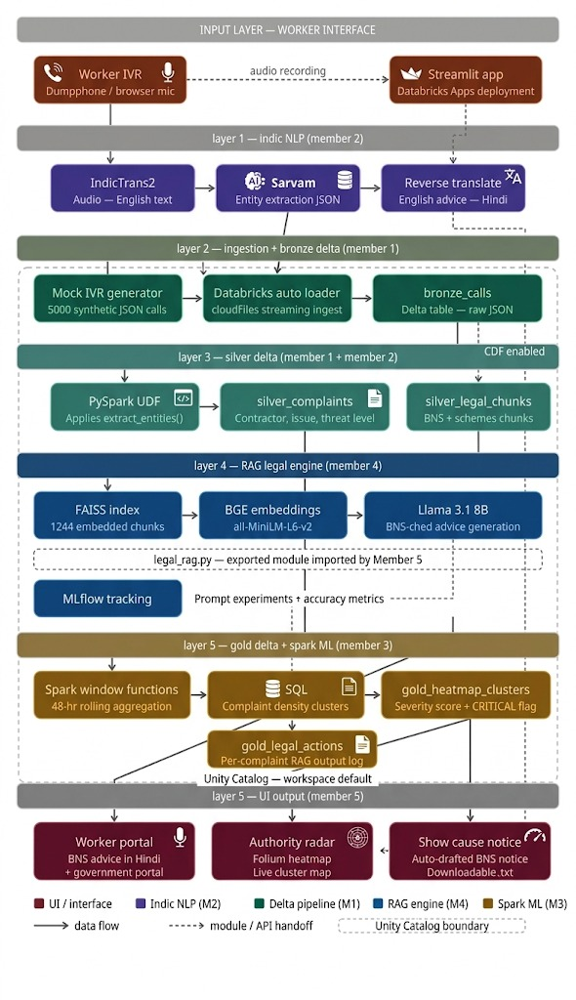
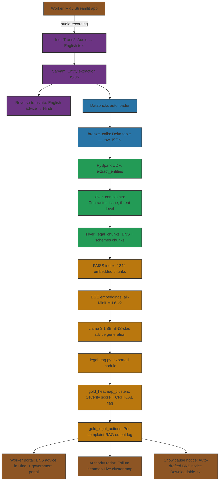

# Shramik Vani - AI Labour Rights Platform

## Overview

Shramik Vani is an AI-powered platform designed to protect labor rights by processing audio complaints from workers in regional languages. The system transcribes audio, analyzes complaints using Indic NLP, identifies legal violations, and provides actionable recommendations to authorities.

Originally developed on Databricks, this project has been adapted for local deployment.

### Demo
https://youtu.be/7GqE_4rF_FQ

## Architecture

The platform architecture is illustrated below:



Or, as a flowchart (for compatible markdown viewers):



The platform consists of five main components:

### 1. Audio Transcription (`audio_to_text/`)
- **File**: `Audio_to_text..py`
- **Function**: Converts audio files (WhatsApp voice messages, recordings) to text using Sarvam AI's speech-to-text API
- **Output**: JSON files with transcribed Hindi text

### 2. Data Extraction (`pipeline/Data_Extraction.py`)
- **Function**: Ingests JSON transcription files into structured data storage
- **Original**: Created bronze_calls Delta table on Databricks
- **Local**: Processes JSON files for further pipeline steps

### 3. Labor Complaint Processing (`pipeline/`)
- **Files**: `Labor Complaint- Indic NLP.py`, `indic_nlp.py`
- **Function**:
  - Uses Sarvam API for Hindi-to-English translation
  - Extracts entities (worker names, contractors, pincodes, complaint types)
  - Classifies complaints by severity (LOW/MEDIUM/HIGH)
  - Aggregates data by location and contractor

### 4. Legal RAG System (`pipeline/legal_rag.py`)
- **Function**: Downloads and processes legal documents (BNS 2023, Wages Code)
- **Features**: Retrieval-Augmented Generation for legal recommendations
- **Input**: High-priority complaints from gold layer
- **Output**: Legal actions and recommendations

### 5. Web Interface (`app/`)
- **File**: `app.py`
- **Framework**: Streamlit
- **Interfaces**:
  - **Worker Portal**: Audio upload → transcription → analysis → legal recommendations
  - **Authority Radar**: Interactive heatmap showing complaint hotspots

## Data Flow

```
Audio Upload → Transcription → Translation → Entity Extraction → Classification → Legal RAG → Recommendations
     ↓              ↓             ↓             ↓                ↓            ↓              ↓
  Worker        Hindi Text    English Text   Structured Data  Severity     Legal Docs    Actions
```

## Local Setup

### Prerequisites
- Python 3.8+
- Internet connection (for Sarvam API calls)
- Sarvam API key (sign up at [sarvam.ai](https://sarvam.ai))

### Installation

1. **Clone/Download the project**
   ```bash
   cd shramik-vani-app
   ```

2. **Install dependencies**
   ```bash
   pip install -r app/requirements.txt
   pip install requests pydub  # Additional dependencies
   ```

3. **Set up environment variables**
   Create a `.env` file or set environment variables:
   ```bash
   export SARVAM_API_KEY="your_sarvam_api_key_here"
   ```

### API Keys Required
- **Sarvam API Key**: For speech-to-text, translation, and NLP services
  - Get from: https://sarvam.ai
  - Used in: `audio_to_text/Audio_to_text..py`, `pipeline/indic_nlp.py`

## Usage

### Running the Web App

```bash
cd app
streamlit run app.py
```

The app will open in your browser with two main interfaces:

1. **Worker Portal**: Upload audio files to get complaint analysis
2. **Authority Dashboard**: View complaint hotspots on an interactive map

### Running Individual Components

#### Audio Transcription
```bash
cd audio_to_text
python Audio_to_text..py  # Note: Update audio_file_path variable
```

#### Data Processing Pipeline
```bash
cd pipeline
python Labor\ Complaint-\ Indic\ NLP.py  # Requires data setup
```

## Project Structure

```
shramik-vani-app/
├── README.md
├── app/
│   ├── app.py              # Main Streamlit application
│   └── requirements.txt    # Python dependencies
├── audio_to_text/
│   └── Audio_to_text..py   # Audio transcription module
├── data/
│   └── call_001.json       # Sample call data
└── pipeline/
    ├── Data_Extraction.py      # Data ingestion
    ├── indic_nlp.py           # Indic NLP processing
    ├── Labor Complaint- Indic NLP.py  # Main processing pipeline
    └── legal_rag.py           # Legal RAG system
```

## Sample Data

The `data/` folder contains sample JSON files with the expected structure:
```json
{
  "call_id": 1,
  "pincode": "400053",
  "hindi_audio_text": "रामेश ने पैसे नहीं दिए दो दिन से",
  "timestamp": "2026-03-29T09:23:56.419701",
  "call_duration_seconds": 108,
  "audio_source": "WhatsApp Audio 2026-03-29 at 09.47.00.mp4"
}
```

## Key Features

- **Multi-language Support**: Processes Hindi audio complaints
- **Real-time Analysis**: End-to-end processing from audio to legal recommendations
- **Geographic Visualization**: Interactive heatmaps for complaint hotspots
- **Legal Integration**: RAG system with Indian labor laws
- **Severity Classification**: Automated threat level assessment
- **Scalable Architecture**: Modular design for easy extension

## Technology Stack

- **Frontend**: Streamlit
- **AI/ML**: Sarvam AI APIs (Speech-to-Text, Translation, NLP)
- **Mapping**: Folium, Streamlit-Folium
- **Data Processing**: Python, JSON
- **Legal Documents**: PDF processing for RAG

## Development Notes

### From Databricks to Local Migration
- **Database**: Replaced Delta tables with local JSON file processing
- **Storage**: Local file system instead of Databricks volumes
- **Secrets**: Environment variables instead of Databricks secrets
- **Dependencies**: Minimal Python packages for local execution

### API Rate Limits
- Sarvam API has rate limits; implement retry logic for production use
- Consider caching translations for repeated text

## Contributing

1. Test individual components locally
2. Ensure API keys are properly configured
3. Add sample data for testing
4. Update documentation for any new features

## License

This project is developed for labor rights advocacy and social impact.

## Contact

For questions about the platform or collaboration opportunities, please reach out to the development team.
